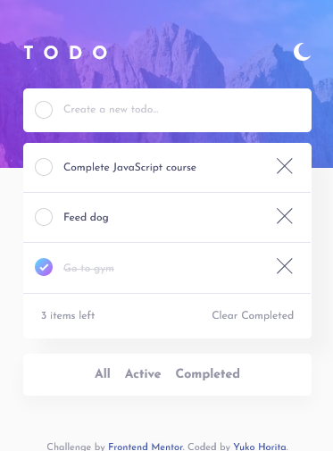
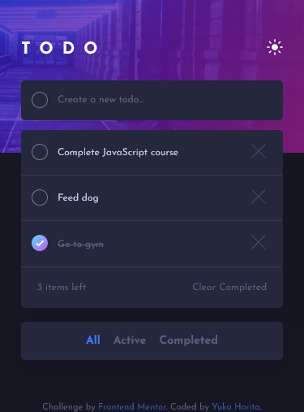
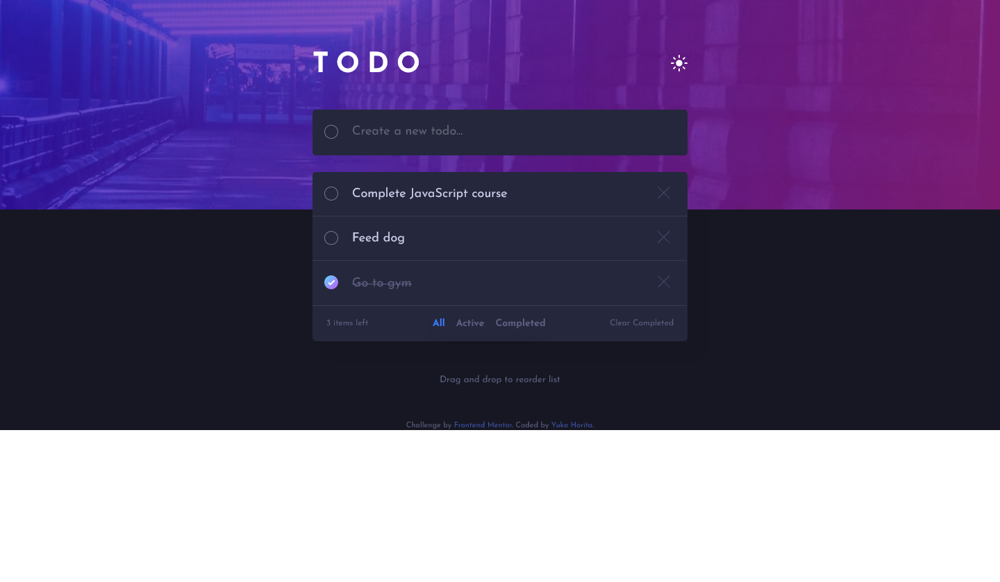
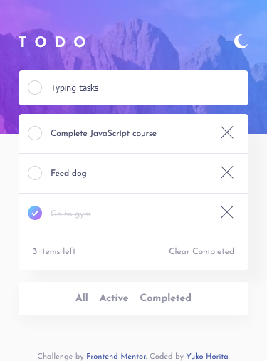
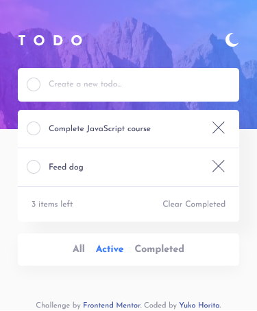
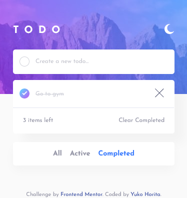

# :heavy_check_mark: Frontend Mentor - Todo app solution using React, Firebase (Firestore) and beautiful DnD (drag & drop)

This is a solution to the [Todo app challenge on Frontend Mentor](https://www.frontendmentor.io/challenges/todo-app-Su1_KokOW). Frontend Mentor challenges help you improve your coding skills by building realistic projects.

## Table of contents

- [Overview](#overview)
  - [The challenge](#the-challenge)
  - [Screenshot](#screenshot)
  - [Links](#links) -[Get Started](#get-started)
- [My process](#my-process)
  - [Built with](#built-with)
  - [What I learned](#what-i-learned)
  - [Continued development](#continued-development)
  - [Useful resources](#useful-resources)
- [Author](#author)

**Note: Delete this note and update the table of contents based on what sections you keep.**

## Overview

This is a single page full-stack Todo App using React.js, Firebase and beautiful dnd library.

### The challenge

Users should be able to:

- View the optimal layout for the app depending on their device's screen size
- See hover states for all interactive elements on the page
- Add new todos to the list
- Mark todos as complete
- Delete todos from the list
- Filter by all/active/complete todos
- Clear all completed todos
- Toggle light and dark mode
- **Bonus**: Drag and drop to reorder items on the list

### Screenshot

**📱 Mobile View (at 375px width)**



**💻 Desktop View (at 1440px width)**


**🕶 Dark Mode**





**⌨ Typing...**



**🔎 Filter Active Tasks**



**🔎 Filter Completed Tasks**



### :link: Links

- Solution URL: [https://www.frontendmentor.io/solutions/to-do-app-w-react-firebase-and-drag-and-drop-izclmiWZh](https://www.frontendmentor.io/solutions/to-do-app-w-react-firebase-and-drag-and-drop-izclmiWZh)
- Live Site URL: [https://to-do-app-fem.firebaseapp.com](https://to-do-app-fem.firebaseapp.com)

## Get Started

1. Make a clone from 'Code' at the top right corner of this repository
2. In your terminal, install node modules by running the following

```
yarn install

or

npm install

```

3. Run live development server [http://localhost:3000/](http://localhost:3000/).

## My process

I wanted to have some experience building an app with React and Firebase, so I chose to store the data in Firebase's Cloud Firestore. In Firestore, the checked status for checkbox and description of task, and the date the document created are stored.

First, I created the apperance of the app by HTML and SCSS then started adding functions to interactive elements, such as buttons. This time I tried not to use context and reducer as much as possible, as this is a small size project. I applied prop driling and only used context and reducers for switching light/ dark mode.

Drag and drop feature was created with [React Beautiful bnb library](https://github.com/atlassian/react-beautiful-dnd/) to make things correctly set rather than manually create with HTML5 drag and drop.

### Built with

- Semantic HTML5 markup
- CSS custom properties
- Sass/Scss
- Flexbox
- CSS Grid
- Mobile-first workflow
- [React](https://reactjs.org/) - JS library
- [Firebase Firestore](https://firebase.google.com/) - For Backend
- [Beautiful dnd](https://github.com/atlassian/react-beautiful-dnd/) - For drag & drop feature

### What I learned

To make the border of checkbox linear gradient color, I googled and found out the following solution adding mask property;

```TaskList.scss
input[type='checkbox'] {
  ...
  &:hover::after,
  &:focus::after {
    background: variables.$bg-check;
    border: none;
    -webkit-mask: linear-gradient(#fff 0 0) content-box,
      linear-gradient(#fff 0 0);
    mask: linear-gradient(#fff 0 0) content-box, linear-gradient(#fff 0 0);
    -webkit-mask-composite: xor;
    mask-composite: exclude;
    padding: 1px;
  }
}

```

### Continued development

- I could make the code for getting firestore data, as I repeat the functions to get the different data to sort/filter the tasks.
- I could use hooks / context file to store most of functions in Tasklist.js, as it is filled with a lot of functions.

### Useful resources

- [How to Add Drag and Drop in React with React Beautiful DnD](https://www.freecodecamp.org/news/how-to-add-drag-and-drop-in-react-with-react-beautiful-dnd/) - It helped me to figure out how I can adopt to reorder the list by drag & drop and store the states using beautiful dnd library.

- [Build Web Apps with React & Firebase](https://www.udemy.com/course/build-web-apps-with-react-firebase/) - It is a great course to understand firebase and react from scratch.

## Author

- Website - [Yuko Horita](https://yukohorita-dev.vercel.app/)
- Frontend Mentor - [@Sloth247](https://www.frontendmentor.io/profile/Sloth247)
- Twitter - [@yuko_webdev](https://www.twitter.com/yuko_webdev)
